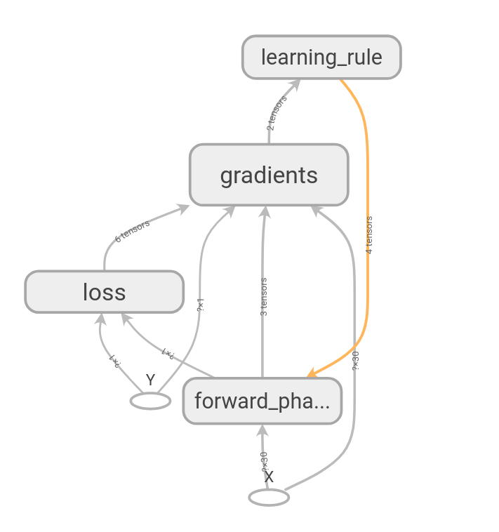
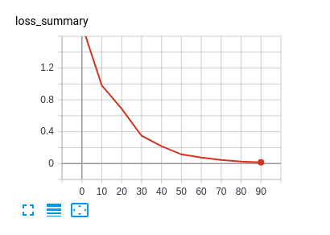

# Complex-Valued Neural Networks (CVNN)
Done by @NEGU93 - J. Agustin Barrachina

This is a library that uses [Tensorflow](https://www.tensorflow.org) as a back-end to do complex-valued neural networks as, as far as I know, CVNNs are barely supported by Tensorflow and not even supported yet for [pytorch](https://github.com/pytorch/pytorch/issues/755) (reason why I decided to use Tensorflow for this library).

Please [Read the Docs](https://complex-valued-neural-networks.readthedocs.io/en/latest/index.html)

## How to use it

The code to create and train a neural network will have the following logic:

1. Initialize a Cvnn object: `cvnn = Cvnn()`
2. Create/define the Graph: `cvnn.create_mlp_graph([(input_size, 'ignored'), (output_size, '')])`
3. Train the graph: `cvnn.train(x_train, y_train, x_test, y_test)`
4. Do what you want (predict? train again?)

The code to load an existing graph will be much easier, as by default, the constructor will look for a folder called `saved_models` and load the newest model (unless automatic_restore is False: `cvnn = Cvnn(automatic_restore=False)`) so to keep training or just load a previously saved model the same code would work.

The model will save periodically according to the `display_freq` parameter of the training function. So if the program stops you will have saved a checkpoint from which you can start again. It will also save, with the same frequency, a summary to be seen by tensorboard.

### Example of usage

```
x_train, y_train, x_test, y_test = dp.load_dataset("linear_output")

input_size = np.shape(x_train)[1]
output_size = np.shape(y_train)[1]

# Network Declaration
cvnn = Cvnn()
cvnn.create_mlp_graph([(input_size, 'ignored'), (output_size, '')])

# Train network
cvnn.train(x_train, y_train, x_test, y_test)

# Run forward network to see results
y_out = cvnn.predict(x_test)
if y_out is not None:
    print(y_out[:3])
    print(y_test[:3])
```

## Tensorboard

This library automatically saves the graph and loss evolution over time to [Tensorboard](https://www.tensorflow.org/tensorboard/r1/summaries) provided the input of the Cvnn constructor `tensorboard` is `True` (which is by default).

Go to `/log/models/<desired/date>/run-<time>/` and run: `tensorboard --logdir tensorboard_logs`
Then open your web browser and connect to: [http://localhost:6006/](http://localhost:6006/)

Tensorboard Graph           |  Tensorboard Summary
:-------------------------:|:-------------------------:
  |  

## Data Processing

Another module apart from CVNN is called data_processing and it is used for all the pre-processing needed to manage the dataset.

## Dependencies

This library has been tested with Tensorflow 2.0.0 and 1.14.0.

Although previous versions of Tensorflow may work correctly the same can not be asserted.
Furthermore, this library will be regularly updated with new Tensorflow releases but will not procure to maintain compatibility with previous versions if something of core changes.


## About me & Motivation
I am a PhD student from [Ecole CentraleSupelec](https://www.centralesupelec.fr/)
with a scholarship from [ONERA](https://www.onera.fr/en)

I am basically working with Complex-Valued Neural Networks for my PhD topic.
In the need of making my coding more dynamic I build a library not to have to repeat the same code over and over for little changes and accelerate therefore my coding.

## Cite Me

```
@MISC {NEGU93-CVNN,
    author       = {J. Agustin Barrachina},
    title        = {Complex-Valued Neural Networks (CVNN)},
    howpublished = {\url{https://github.com/NEGU93/cvnn}},
    journal      = {GitHub repository},
    year         = {2019}
}
```
